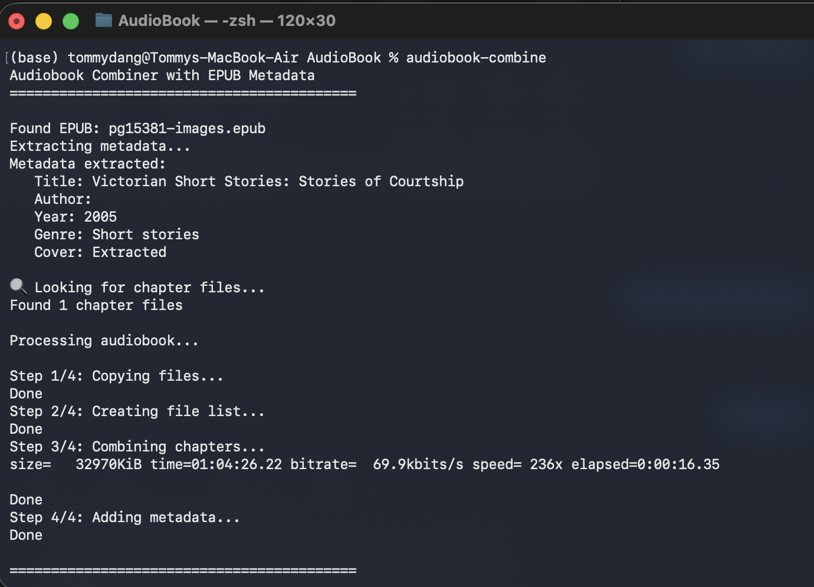

# Bash File for Automated Metadata Collection - Works with Audiblez

## Features:

- ✅ Automatic metadata extraction from EPUB
- ✅ Include the book cover art
- ✅ Proper chapter detection
- ✅ AAC encoding at 64kbps (good quality, small file size)
- ✅ Apple Books compatible format
- ✅ Automatic cleanup of temporary files

## Demos:

Below are demo images of the audiobook workflow:




## Table of Contents

1. [Part 1: Audiblez Setup](#part-1-audiblez-setup)
2. [Part 2: Audiobook Combiner Script](#part-2-audiobook-combiner-script)

---

# Part 1: Audiblez Setup

## What is Audiblez?

Audiblez generates audiobooks from EPUB files using Kokoro-82M, a high-quality text-to-speech model with natural-sounding output. It's completely free, unlimited, and works offline.

For more information, visit the [original Audiblez GitHub page](https://github.com/santinic/audiblez).

## Prerequisites

- macOS (any recent version)
- Python 3.9 - 3.12 (Audiblez does NOT work with Python 3.13+)
- Homebrew (macOS package manager)
- Basic Terminal knowledge

## Step 1: Install Homebrew

If you don't have Homebrew installed, open Terminal and run:

```bash
/bin/bash -c "$(curl -fsSL https://raw.githubusercontent.com/Homebrew/install/HEAD/install.sh)"
```

Follow the on-screen instructions to complete the installation.

## Step 2: Install Dependencies

Install the required system dependencies:

```bash
brew install ffmpeg espeak-ng
```

## Step 3: Install Python 3.12

Install Python 3.12 using Homebrew:

```bash
brew install python@3.12
```

## Step 4: Create a Virtual Environment

Create a dedicated folder and virtual environment for Audiblez:

```bash
mkdir ~/audiblez
cd ~/audiblez
python3.12 -m venv venv
```

Activate the virtual environment:

```bash
source venv/bin/activate
```

You should see `(venv)` appear at the start of your terminal prompt.

## Step 5: Install Audiblez with GUI Support

With the virtual environment activated, install Audiblez and the GUI dependencies:

```bash
pip install audiblez pillow wxpython
```

This will take a few minutes to download and install everything.

## Step 6: Test Audiblez

Launch the GUI to make sure everything works:

```bash
audiblez-ui
```

## Step 7: Create a Mac App (One-Click Launch)

Instead of typing commands every time, create a clickable app:

### Using Automator:

1. **Open Automator**
   - Press `Cmd + Space` and type "Automator"
   - Click "New Document"
   - Choose "Application"

2. **Add Shell Script**
   - In the search bar on the left, type "Run Shell Script"
   - Drag "Run Shell Script" into the workflow area
   - Change "Pass input" dropdown to "as arguments"
   - Paste this script:

```bash
cd ~/audiblez
source venv/bin/activate
audiblez-ui
```

3. **Save the App**
   - Go to File → Save (or press `Cmd + S`)
   - Name it "Audiblez"
   - Save location: Applications folder (or Desktop)
   - Click "Save"

4. **Done!**
   - You can now double-click the Audiblez app icon to launch it
   - No need to open Terminal anymore!

### Optional: Add a Custom Icon

1. Find an image you like online and copy it (`Cmd + C`)
2. Right-click your new Audiblez app → Get Info
3. Click the small icon in the top left corner of the info window
4. Paste (`Cmd + V`)

## Using Audiblez

### GUI Method (Recommended):

1. Double-click your Audiblez app (or run `audiblez-ui` in Terminal)
2. Select your EPUB file
3. Choose a voice from the dropdown
4. Adjust speed if desired (1.0 is normal speed)
5. Click convert
6. Find your M4B audiobook in the same folder as your EPUB

### Command Line Method:

For command line usage and advanced options, refer to the [original Audiblez GitHub page](https://github.com/santinic/audiblez).

---

# Part 2: Audiobook Combiner Script

## Creating the Bash Script

### Step 1: Open Terminal

Press `Cmd + Space`, type "Terminal", and press Enter.

### Step 2: Navigate to Your Audiobook Folder

**Option 1: If your folder is in your home directory**
```bash
cd ~/audiblez
```

**Option 2: Copy the folder path from Finder**

1. Open Finder and navigate to your audiobook folder
2. Right-click on the folder
3. Hold down the `Option` key (you'll see "Copy" change to "Copy as Pathname")
4. Click "Copy as Pathname"
5. In Terminal, type `cd ` (with a space after cd)
6. Paste the path: `Cmd + V`
7. Press `Enter`

**Example:**
```bash
cd /Users/yourname/Documents/audiobooks
```

### Step 3: Create the Script File

```bash
nano combine-audiobook.sh
```

This opens the nano text editor.

### Step 4: Add the Script Code

Copy the code from the `combine-audiobook.sh` file in this repository and paste it into the terminal.

To paste in Terminal: `Cmd + V`

### Step 5: Save the File

Press `Control + X`, then press `Y`, then press `Enter`.

### Step 6: Make the Script Executable

```bash
chmod +x combine-audiobook.sh
```

## Using the Combiner Script

### Basic Usage:

Place your chapter WAV files and optionally your EPUB file in the same folder, then run:

```bash
./combine-audiobook.sh
```

### What the Script Expects:

**Option 1: With EPUB (Automatic Metadata)**
```
your-folder/
  ├── book.epub
  ├── book_chapter_1.wav
  ├── book_chapter_2.wav
  ├── book_chapter_3.wav
  └── combine-audiobook.sh
```

**Option 2: Without EPUB (Manual Metadata)**
```
your-folder/
  ├── book_chapter_1.wav
  ├── book_chapter_2.wav
  ├── book_chapter_3.wav
  └── combine-audiobook.sh
```

If no EPUB is found, the script will ask you to enter:
- Book Title
- Author
- Year
- Genre

### Output:

The script will create a file named: `Book Title - Author.m4b`

Example: `The Great Gatsby - F. Scott Fitzgerald.m4b`

## What the Script Does Step-by-Step:

1. **Checks for dependencies** (ffmpeg and unzip)
2. **Looks for EPUB file** and extracts:
   - Title
   - Author
   - Year
   - Genre
   - Cover image
3. **Finds all chapter WAV files** (files containing "chapter" in the name)
4. **Combines chapters** into one audio file
5. **Adds metadata** and cover art
6. **Cleans up** temporary files
7. **Creates final M4B** ready for Apple Books

---

## Updating Audiblez

To update to the latest version:

```bash
cd ~/audiblez
source venv/bin/activate
pip install --upgrade audiblez
```

## Uninstalling

To completely remove Audiblez:

```bash
rm -rf ~/audiblez
rm /Applications/Audiblez.app  # if you created the app
```

## Additional Resources

- [Audiblez GitHub](https://github.com/santinic/audiblez)
- [Kokoro Voice Samples](https://claudio.uk/posts/audiblez-v4.html)
- [Voice Quality Details](https://huggingface.co/hexgrad/Kokoro-82M/blob/main/VOICES.md)

## Tips & Best Practices

- **Voice selection**: Listen to samples before converting long books
- **Speed**: Most people prefer 1.1x - 1.3x for audiobooks
- **Chapters**: If your EPUB has good chapter structure, the M4B will too
- **Metadata**: The combiner script handles metadata automatically when EPUB is present
- **Backups**: Keep your original EPUB files
- **Chapter files**: Must have "chapter" in their filename for the combiner to detect them
- **Encoding**: The script uses 64kbps AAC encoding (modify `-b:a 64k` in script to change bitrate)
- **Original files**: Original chapter WAV files are not deleted by the combiner (only temp files are removed)

## Performance Notes

With M4 MacBook A book with ~450,000 characters takes approximately 2 hours and 20 minutes to convert processing time varies based on your Mac's CPU and book length. It runs on CPU only (no GPU acceleration on Mac currently)


---

**Created by Tommy with ❤️**
